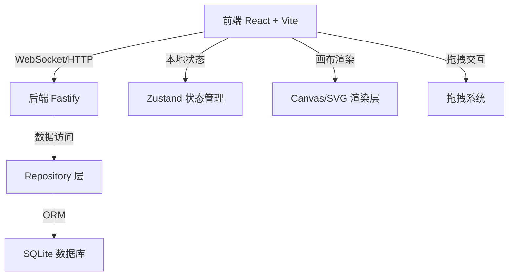
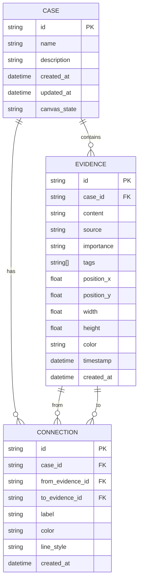
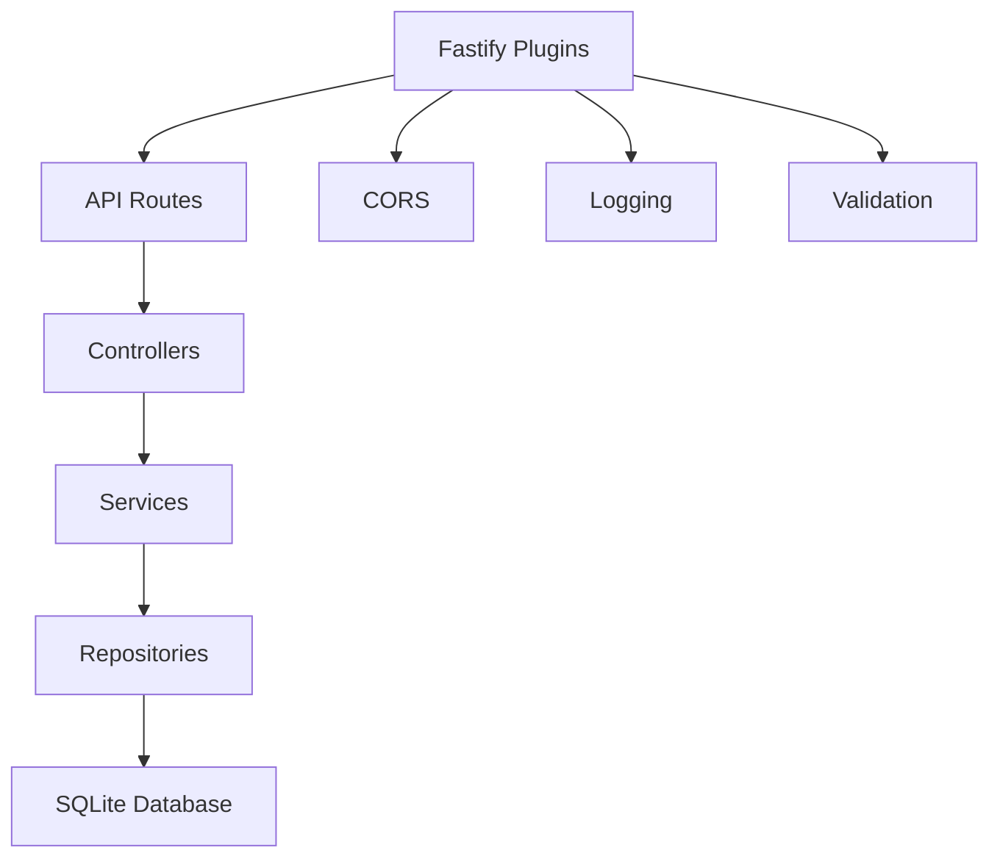

## 1. 架构设计



## 2. 技术描述

- **前端**：React@18 + TypeScript + Vite@5 + TailwindCSS@3 + Zustand@4
  - 画布渲染：自定义 SVG 连线系统 + HTML5 拖拽 API
  - 状态管理：Zustand 分模块管理（案件、画布、证据）
  - 导出功能：html2canvas 快照导出
- **后端**：Node.js + Fastify@4 + TypeScript
  - Web 框架：Fastify 高性能 HTTP 服务器
  - 数据库：better-sqlite3 同步 SQLite 驱动
  - API 风格：RESTful + WebSocket 实时同步
- **数据库**：SQLite 本地文件数据库，支持案件数据持久化
- **初始化工具**：Vite React-TS 模板

## 3. 目录结构

```
project/
├── client/                    # 前端应用
│   ├── src/
│   │   ├── components/        # 公共组件
│   │   │   ├── EvidenceCard/
│   │   │   ├── Canvas/
│   │   │   ├── Toolbar/
│   │   │   ├── Sidebar/
│   │   │   └── PropertyPanel/
│   │   ├── hooks/             # 自定义 Hooks
│   │   │   ├── useCanvas.ts
│   │   │   ├── useDragDrop.ts
│   │   │   └── useZoom.ts
│   │   ├── store/             # Zustand 状态
│   │   │   ├── useCaseStore.ts
│   │   │   ├── useCanvasStore.ts
│   │   │   └── useEvidenceStore.ts
│   │   ├── types/             # 类型定义
│   │   ├── utils/             # 工具函数
│   │   ├── App.tsx
│   │   └── main.tsx
│   └── package.json
├── server/                    # 后端应用
│   ├── src/
│   │   ├── controllers/       # 控制器层
│   │   ├── services/          # 业务逻辑层
│   │   ├── repositories/      # 数据访问层
│   │   ├── models/            # 数据模型
│   │   ├── routes/            # 路由定义
│   │   ├── plugins/           # Fastify 插件
│   │   └── index.ts
│   └── package.json
├── shared/                    # 共享类型
│   └── types.ts
└── package.json               # 根 package.json
```

## 4. 路由定义

| 前端路由 | 用途 |
|---------|------|
| / | 主工作台（唯一页面） |

| 后端 API | 方法 | 用途 |
|---------|------|------|
| /api/cases | GET | 获取所有案件列表 |
| /api/cases | POST | 创建新案件 |
| /api/cases/:id | GET | 获取案件详情 |
| /api/cases/:id | PUT | 更新案件信息 |
| /api/cases/:id | DELETE | 删除案件 |
| /api/cases/:id/evidence | GET | 获取案件所有证据 |
| /api/cases/:id/evidence | POST | 添加证据 |
| /api/evidence/:id | PUT | 更新证据 |
| /api/evidence/:id | DELETE | 删除证据 |
| /api/cases/:id/connections | GET | 获取所有连线 |
| /api/cases/:id/connections | POST | 创建连线 |
| /api/connections/:id | DELETE | 删除连线 |
| /api/cases/:id/snapshot | POST | 保存画布快照 |
| /api/health | GET | 健康检查 |

## 5. 数据模型

### 5.1 ER 图



### 5.2 DDL 语句

```sql
CREATE TABLE cases (
    id TEXT PRIMARY KEY,
    name TEXT NOT NULL,
    description TEXT,
    created_at DATETIME DEFAULT CURRENT_TIMESTAMP,
    updated_at DATETIME DEFAULT CURRENT_TIMESTAMP,
    canvas_state TEXT
);

CREATE TABLE evidence (
    id TEXT PRIMARY KEY,
    case_id TEXT NOT NULL REFERENCES cases(id) ON DELETE CASCADE,
    content TEXT NOT NULL,
    source TEXT,
    importance TEXT DEFAULT 'normal',
    tags TEXT,
    position_x REAL DEFAULT 0,
    position_y REAL DEFAULT 0,
    width REAL DEFAULT 280,
    height REAL DEFAULT 160,
    color TEXT DEFAULT '#00f0ff',
    timestamp DATETIME,
    created_at DATETIME DEFAULT CURRENT_TIMESTAMP
);

CREATE TABLE connections (
    id TEXT PRIMARY KEY,
    case_id TEXT NOT NULL REFERENCES cases(id) ON DELETE CASCADE,
    from_evidence_id TEXT NOT NULL REFERENCES evidence(id) ON DELETE CASCADE,
    to_evidence_id TEXT NOT NULL REFERENCES evidence(id) ON DELETE CASCADE,
    label TEXT,
    color TEXT DEFAULT '#ff0055',
    line_style TEXT DEFAULT 'solid',
    created_at DATETIME DEFAULT CURRENT_TIMESTAMP
);

CREATE INDEX idx_evidence_case_id ON evidence(case_id);
CREATE INDEX idx_connection_case_id ON connections(case_id);
CREATE INDEX idx_connection_from ON connections(from_evidence_id);
CREATE INDEX idx_connection_to ON connections(to_evidence_id);
```

### 5.3 TypeScript 类型定义

```typescript
// shared/types.ts
export interface Case {
  id: string;
  name: string;
  description: string;
  createdAt: string;
  updatedAt: string;
  canvasState?: CanvasState;
}

export interface Evidence {
  id: string;
  caseId: string;
  content: string;
  source: string;
  importance: 'low' | 'normal' | 'high' | 'critical';
  tags: string[];
  positionX: number;
  positionY: number;
  width: number;
  height: number;
  color: string;
  timestamp: string;
  createdAt: string;
}

export interface Connection {
  id: string;
  caseId: string;
  fromEvidenceId: string;
  toEvidenceId: string;
  label: string;
  color: string;
  lineStyle: 'solid' | 'dashed' | 'dotted';
  createdAt: string;
}

export interface CanvasState {
  zoom: number;
  panX: number;
  panY: number;
}

export interface SearchFilter {
  keyword: string;
  tags: string[];
  importance?: Evidence['importance'];
  dateRange?: { start: string; end: string };
}
```

## 6. 服务器架构



## 7. 模块划分

### 前端模块
1. **evidence** - 证据卡片管理（CRUD、拖拽、编辑）
2. **canvas** - 画布系统（缩放、平移、渲染、连线）
3. **toolbar** - 工具栏（案件操作、视图控制、导出）
4. **sidebar** - 侧边栏（证据库、搜索过滤）
5. **property-panel** - 属性编辑面板
6. **export** - 快照导出模块

### 后端模块
1. **cases** - 案件管理 API
2. **evidence** - 证据 CRUD API
3. **connections** - 连线管理 API
4. **database** - 数据库初始化与迁移
5. **persistence** - 持久化服务（自动保存、快照）
